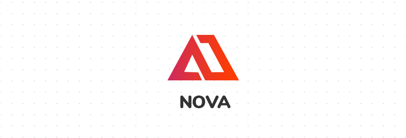
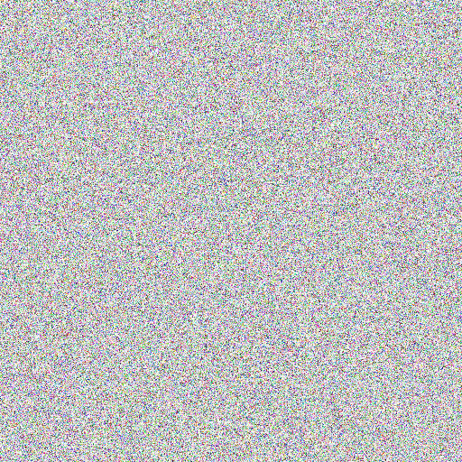

<!-- PROJECT LOGO -->
<br />

<p align="center">

<p align="center">
  <a aria-label="Vercel logo" href="http://hossamsherif.com">
    
  </a>
 </p>

  <!-- <a href="https://github.com/hussamsh/Nova">
    
  </a>

<b><h1 align="center">NOVA</h1></b> -->

  <p align="center">
    A cryptography application for images based on chaotic maps
    <br />
    <br />
    <a href="https://github.com/github_username/repo/issues">Report Bug</a>
    ·
    <a href="https://github.com/github_username/repo/issues">Request Feature</a>

  </p>

</p>


<!-- TABLE OF CONTENTS -->
## Table of Contents

- [Table of Contents](#table-of-contents)
- [About The Project](#about-the-project)
  - [Built With](#built-with)
- [Getting Started](#getting-started)
  - [Download](#download)
  - [Usage](#usage)
  - [Remarks](#remarks)
- [Security](#security)
- [Examples](#examples)
- [Valid inputs](#valid-inputs)
- [Roadmap](#roadmap)
- [Development](#development)
  - [Prerequisites](#prerequisites)
  - [Installation](#installation)
- [C++ implementation](#c-implementation)
- [License](#license)
- [Contact](#contact)

<!-- ABOUT THE PROJECT -->
## About The Project

Nova's idea is to become a software equivilant for a part of my research on hardware implementations of chaotic ciphers, it utilizes `chaotic maps` and pixel by pixel encrpytion algorithms to cipher images.

I have already published part of my research if you would like to read more

**CLA based Floating-point adder suitable for chaotic generators on FPGA** on [IEEEXplore](https://ieeexplore.ieee.org/document/8704074)<br>
**Double humped based image encryption system on FPGA** (_under review_)

[![Product Name Screen Shot][product-screenshot]]()

*Nova currently implements three chaotic maps*
* **Logistic map** 
  Based on Robert May's [work](https://www.researchgate.net/publication/237005499_Simple_Mathematical_Models_With_Very_Complicated_Dynamics) back in 1976, the logistic map is the most iconic and heavily researched chaotic maps in his history.
* **Double humped map**
  Popularized by [Coiteux](https://core.ac.uk/download/pdf/61733598.pdf) in 2014, the double humped map shows a double hump in it's first iteration - hence the name - and exhibits some unique behavior that mkes it highly suitable for cryptogragic operations.
* **Hénon map**
    Another widely recognized map, introduced by Micheal Hénon as a simplified model of the Poincaré section of the Lorenz model. 
<!-- **To avoid retyping too much info. Do a search and replace with your text editor for the following:** !-->
<!-- `github_username`, `repo`, `twitter_handle`, `email`  -->


### Built With

* [Electron](https://www.electronjs.org/)
* [React](https://reactjs.org/)


<!-- GETTING STARTED -->
## Getting Started

### Download
Download the lateset stable distribution for your OS.

[![windows 10][windows]](https://s3.eu-central-1.amazonaws.com/com.hossamsherif.nova/release-builds/nova-windows.zip) 
[![macos][macos]](https://s3.eu-central-1.amazonaws.com/com.hossamsherif.nova/release-builds/nova-macOs.zip) 
[![linux][linux]](https://s3.eu-central-1.amazonaws.com/com.hossamsherif.nova/release-builds/nova-linux.zip) 

### Usage

**Step 1 )**  Choose the desired image for encryption / decryption by drag-drop or clicking browse in the designated area. 


**Step 2 )**  Enter the desired params for your choosen map as well as an output directory for the processed image.

<!--  -->

<!-- [![Product Name Screen Shot][params-screenshot]]() -->


**Step 3 )**  Press Encrypt / Decrypt and wait for your image to be processed. Once finished you will find the processed image in the output directory with a suffix of either _encrypted / _decrypted.


### Remarks

* It is highly recommended to always turn on the resize option mainly because encryption performance is inversly propotional with the number of pixels an image has. The only time you need to disable resizing is when pixel information is critical but that will result in a much reduced perfomance.
  
* Values choosen for each map must be valid see this [section](#valid-inputs) to learn more.

* Make sure when decrypting to enter the exact same values used for encryption, any simple variation or mismatch will result in decryption not being successful.

## Security

One aspect of measuring the security of any encrypton is called `key space analysis` which is simply the number of keys - permutations - that an attacker has to through in order to find the parameters your are using.

A map like the double humped map has three input parameters at 64 bits length yields it's size to be 192 bits long which constitues a key space of  keys in total which is large enough to resist any kind of brute force attackes.

Of course there are other aspects of measuring security for an encryption system such as entropy, key sensitivity analysis, differential attacks ... etc. For a thourgh analysis of our Double humped map example, read this [journal](https://www.sciencedirect.com/science/article/pii/S2090123218300195)


## Examples

|Original                                       | Encrypted                                                         |
|:---------------------------------------------:|:------------------------------------------------------------------:| 
||      |
||  |


## Valid inputs

Each chaotic map has certain valid ranges that it can operate within. For successful encryption, you need to choose values such that the ouptut of the map will be chaotic.

* Logistic map
  
  ![\lambda \in \[0,4\], \lambda_{chaos} > 3.6](https://render.githubusercontent.com/render/math?math=%5Clambda%20%5Cin%20%5B0%2C4%5D%2C%20%5Clambda_%7Bchaos%7D%20%3E%203.6)

  ![x \in \[0,1\]](https://render.githubusercontent.com/render/math?math=x%20%5Cin%20%5B0%2C1%5D)

* Double humped map
  
  ![\lambda \in \[0, \frac{8}{c^3}\]](https://render.githubusercontent.com/render/math?math=%5Clambda%20%5Cin%20%5B0%2C%20%5Cfrac%7B8%7D%7Bc%5E3%7D%5D)
  
  ![x \in \[0, 2c\]](https://render.githubusercontent.com/render/math?math=x%20%5Cin%20%5B0%2C%202c%5D)

  exact chaotic regions will depend on , as an example for  .

* For the Henon map there is no way - as far as I have researched - to check wether the initial parameters will diverge to the attractor or infinity, therfore the encryption is stopped anytime the sequence diverges to infinity. 
  
## Roadmap

* Adding more maps to choose from.
* Histograms and comaprisons right inside the app


## Development

If you would like to develop a new feature or see how the code is running under the hood follow these steps.

### Prerequisites
* **Node**
  
  Install node from the [offical mirror](https://nodejs.org/en/download/) - this comes with `npm` too.

### Installation

* **Fork the project / Download**

* **Install NPM packages** 
  ```sh
   cd Nova
   npm install 
  ```
* **Build project**
  ```sh
  npm run build
  ```
  or to watch your files 
  ```sh
  npm run watch
  ```
* **Test**

  Test to see that everything is working
  ```sh
  npm run test
  ```
* **Run**
  ```sh
  npm run start
  ```

## C++ implementation

I have implemented this project in c++ which run from CLI and perofrmes at 3 - 5 times the speed of this implementation in javascript. Check it out in this [github repo](). 


## License

TODO

## Contact

TODO


[product-screenshot]: ./app/assets/images/screenshot.png
[params-screenshot]: ./app/assets/images/choose-param.png
[windows]: ./app/assets/images/microsoft.png
[macos]: ./app/assets/images/macos.png
[linux]: ./app/assets/images/linux.png
